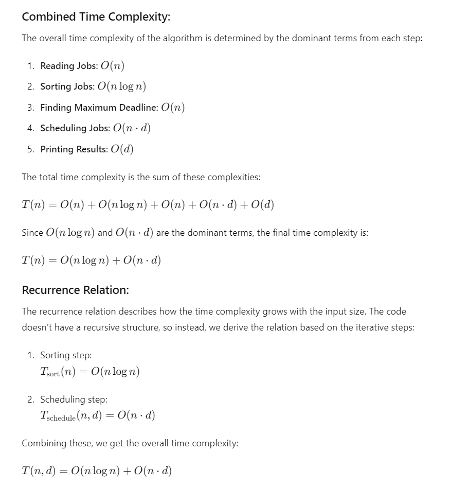

# Job Scheduling for Maximum Profit
**QuickDrop Drone Delivery Service**

**Course**
CSC4202 - Design & Analysis Of Algorithm

**Group Name:** Super Saiyan

**Team Members & Roles:**
1. **MUHAMMAD ARIF AIMAN BIN MOHD HISAM** (Leader)
2. **NURDIYANA ATHIRAH BINTI MOHD ASMAN** (Designer)
3. **MUHAMAD ZUL AIMAN BIN MOHD AMRAN** (Developer)

---

## 1.0 Problem Scenario

In a bustling metropolitan area, a drone delivery service company, "QuickDrop," operates to ensure packages are delivered promptly and efficiently. Each delivery job has a deadline (by when it must be completed) and a profit associated with it. The company aims to maximize its total profit by optimally scheduling deliveries within their respective deadlines.

**Geographical Setting:** The city is divided into several zones, each with varying traffic conditions and distances. The scheduling must account for these factors to ensure timely deliveries. 

**Type of Disaster:** Not applicable in this scenario.

**Damage Impact:** Delays in deliveries can lead to customer dissatisfaction, loss of future business, and reduced profits.

**Importance:** Finding an optimal solution for this scenario is crucial because it maximizes the company's revenue, ensures timely deliveries, enhances customer satisfaction, and improves operational efficiency.

**Goal and Expected Output:** The goal is to develop an algorithm that schedules jobs to maximize total profit while meeting all deadlines. The expected output is a schedule that lists the jobs to be completed within their deadlines and the total profit achieved.

---

## 2.0 Development of a Model
### 2.1 Data Types:
- Jobs: Represented as an array of Job objects, each containing (jobId, deadline, profit). For example:
    - jobId (String)
    - deadline (int)
    - profit (int)
 - Example:
   - Job 1: ('A001', 2, 100)
   - Job 2: ('B002', 1, 50)
   - Job 3: ('C003', 2, 150)

### 2.2 Objective Function:
- **Maximize Total Profit:** Tp maximize the total profit by selecting jobs that can be completed within their deadlines.

### 2.3 Constraints:
- **Deadline Constraint**: Each job must be completed by its deadline.
    - Example: If a job has a deadline of 2, it can only be scheduled in time slots 1 or 2.
- **Non-Overlapping Constraint**: No two jobs can be scheduled at the same time slot.
    - Ensures that only one job is assigned per time slot.

### 2.4 Other Requirements:
   - **Space Constraint:**
       - Use space proportional to the number of jobs and the maximum deadline O(n + d).
       - Includes arrays to store jobs and scheduled jobs.

   - **Time Constraint:**
       - Sorting: O(n log n) for sorting jobs by profit.
       - Scheduling: O(n * d) for scheduling jobs up to their deadlines.

   - **Value Constraint:**
       - Profits and deadlines must be positive integers.

Example:
- Profit Values: All job profits are positive integers.
- Deadlines: All deadlines are positive integers.

---

### 2.5 Simple Example 

---

## 3.0 Specification of an Algorithm

### 3.1 Comparison with Other Algorithms:

**3.1.1 Divide and Conquer (DAC):**
- Strengths: DAC is highly effective for problems that can be broken down into smaller subproblems, solved independently, and then combined to form the solution for the original problem. Examples include sorting algorithms like QuickSort and MergeSort.
- Weaknesses: DAC may not be the best choice for problems requiring global optimization, like job scheduling, where the solution to a subproblem depends on the solutions to other subproblems. It can fail to consider dependencies between subproblems, leading to suboptimal solutions.

**3.1.2 Dynamic Programming (DP):**
- Strengths: DP systematically explores all possible solutions by storing the results of subproblems, ensuring that the optimal solution is found. It is effective for optimization problems where overlapping subproblems and optimal substructure are present.
- Weaknesses: DP often requires significant memory to store the results of subproblems, which can be problematic for large-scale problems.

**3.1.3 Greedy Algorithm:**
- Strengths: Greedy algorithms are typically straightforward to design and implement, making them accessible for a wide range of problems.
- Weaknesses: Greedy algorithms make decisions based on local optimization, which can sometimes lead to suboptimal global solutions. They are not guaranteed to find the best solution for all problems.

**3.1.4 Graph Algorithms:**
- Strengths: Graph algorithms excel in solving problems related to network flow, shortest paths, and connectivity. They are powerful tools for a wide range of applications, from internet routing to social network analysis.
- Weaknesses: While graph algorithms can be used for scheduling problems by modeling jobs and dependencies as graphs, the implementation can be complex. It often involves sophisticated data structures and a deep understanding of graph theory.

---

### 3.2 Chosen Algorithm: Greedy Algorithm

1. Suitability for Job Scheduling: Greedy algorithms are particularly well-suited for job scheduling problems where jobs need to be selected based on specific criteria (e.g., profit) and fit within given constraints (e.g., deadlines).
2. Efficiency: The greedy approach allows for quick decision-making, which is crucial for operational efficiency in a real-time environment like drone delivery.
3. Implementation: The implementation of a greedy algorithm is straightforward, making it easier to develop, test, and maintain compared to more complex algorithms like dynamic programming or graph-based approaches.
4. Good Approximation: While not always optimal, the greedy algorithm often yields solutions that are very close to the best possible outcome, especially in scenarios where making the locally optimal choice leads to a near-optimal global solution

---

## 4.0 Designing an Algorithm

---

### 4.1 Algorithm Paradigm Explanation
This paradigm involves making the locally optimal choice at each step with the hope of finding a global optimum.

#### 4.1.1 Key Components

**1. Sorting Jobs by Profit:**
    - Purpose: To prioritize jobs with the highest profit.
    - Process: Jobs are sorted in descending order based on their profit.

**2. Iterative Scheduling:**
    - Purpose: To schedule jobs in the available time slots up to their deadlines.
    - Process:
        - Iterate through the sorted jobs.
        - For each job, find the latest available time slot before its deadline.
        - If an available slot is found, schedule the job and update the total profit.

#### 4.1.2 Recurrence and Optimization
- Recurrence: There is no explicit recurrence relation in this greedy approach. *Instead, the algorithm iteratively makes the best local decision (highest profit job that fits) and moves on to the next job.
- Optimization Function: The optimization function here is the total profit, which is incrementally updated as jobs are scheduled.

        for (int j = Math.min(maxDeadline - 1, jobs[i].deadline - 1); j >= 0; j--) {
              if (result[j] == null) {
                  result[j] = jobs[i];
                  totalProfit += jobs[i].profit; (Optimization Part)
                  break;
              }
         }

---

### 4.2 Code Breakdown
- Sorting: Arrays.sort(jobs, (a, b) -> b.profit - a.profit);
    - Time Complexity: O(n log n)

      
- Scheduling: Iterate through each job and find a free slot from its deadline backward.
    - For each job:
 
          for (int j = Math.min(maxDeadline - 1, jobs[i].deadline - 1); j >= 0; j--) {
              if (result[j] == null) {
                  result[j] = jobs[i];
                  totalProfit += jobs[i].profit;
                  break;
              }
          }
    - Time Complexity: 𝑂(𝑛×𝑑), where d is the maximum deadline.

---

### 4.3 FLowchart

---

## 5.0 Checking the Correctness of an Algorithm (Asymptotic Only, No Recurrence)

### 5.1 Greedy Choice Property
The greedy choice property ensures that making a locally optimal choice (choosing the highest profit job that fits within its deadline) leads to a globally optimal solution.

### 5.2 Optimal Substructure
Optimal substructure means that an optimal solution to the problem contains optimal solutions to its subproblems. For the job scheduling problem, this implies that if we schedule the most profitable jobs first, the remaining jobs will still form an optimal schedule for the remaining slots.

### 5.3 Steps in the Code:

### 5.4 Summary:
- **Asymptotic Time Complexity:** O(n log n) + O(n.d)
- **Recurrence Relation:** Since the algorithm is not recursive, we don't have a traditional recurrence relation. Instead, the time complexity is derived from the combination of sorting and scheduling steps.

---

## 6.0 Analysis of an Algorithm Growth of Function for Worst, Best, Average Analysis

### 6.1 Worst-Case Analysis

- The worst-case scenario occurs when the algorithm has to perform the maximum number of operations.
    - For the job scheduling algorithm, this happens when:
        - Sorting Jobs by Profit: This is always 𝑂(𝑛 log 𝑛) because sorting needs to be done irrespective of the job deadlines or profits.
        - Finding the Maximum Deadline: This is 𝑂(𝑛) as it requires scanning through all jobs.
        - Scheduling Jobs: In the worst case, each job needs to be checked against all deadlines to find an available slot. This involves nested loops where the outer loop runs 𝑛 times (for each job) and the inner loop runs up to 𝑑 times (the maximum deadline).
- Thus, the worst-case time complexity is: 𝑇(𝑤𝑜𝑟𝑠𝑡)(𝑛) = 𝑂(𝑛log⁡𝑛) + 𝑂(𝑛) + 𝑂(𝑛⋅𝑑) = 𝑂(𝑛log𝑛 + 𝑛⋅𝑑)

### 6.2 Best-Case Analysis

- The best-case scenario happens when each job can be placed in its slot immediately without needing to check multiple slots.
    - However, since the algorithm always sorts the jobs, the best-case time complexity is still influenced by the sorting step:
        - Sorting Jobs by Profit: This is 𝑂(𝑛log𝑛)
        - Finding the Maximum Deadline: This is 𝑂(𝑛).
        - Scheduling Jobs: Each job is placed in its slot without conflicts. This is still 𝑂(𝑛⋅𝑑) as it needs to check each slot to confirm it's free, even if it's optimal.
- Thus, the best-case time complexity is: 𝑇(𝑏𝑒𝑠𝑡)(𝑛) = 𝑂(𝑛log⁡𝑛) + 𝑂(𝑛) + 𝑂(𝑛⋅𝑑) = 𝑂(𝑛log𝑛 + 𝑛⋅𝑑)

### 6.3 Average-Case Analysis

- The average-case scenario is typically more complex to analyze theoretically because it involves the expected number of operations over all possible inputs
    - However, for this algorithm, it also involves sorting and scheduling which are influenced similarly to the worst and best cases:
        - Sorting Jobs by Profit: This is 𝑂(𝑛log𝑛)
        - Finding the Maximum Deadline: This is 𝑂(𝑛).
        - Scheduling Jobs: On average, we still need to check multiple slots for each job, but this number is generally around half the maximum deadline.
- Thus, the best-case time complexity is: 𝑇(𝑎𝑣𝑒𝑟𝑎𝑔𝑒)(𝑛) = 𝑂(𝑛log⁡𝑛) + 𝑂(𝑛) + 𝑂(𝑛⋅𝑑) = 𝑂(𝑛log𝑛 + 𝑛⋅𝑑)

---

## 7.0 Implementation of an Algorithm
// Job.java

    public class Job {
      String jobId;
      int deadline;
      int profit;
      
    public Job(String jobId, int deadline, int profit) {
        this.jobId = jobId;
        this.deadline = deadline;
        this.profit = profit;
    }
    }

// JobScheduler.java

    import java.io.BufferedReader;
    import java.io.FileReader;
    import java.io.IOException;
    import java.util.Arrays;
    
    public class JobScheduler {
    
      //Function to schedule jobs to maximize total profit
      public static void scheduleJobs(Job[] jobs) {
          // Sort jobs by profit in descending order
          Arrays.sort(jobs, (a, b) -> b.profit - a.profit);
  
          int n = jobs.length;
  
          // Find the maximum deadline
          int maxDeadline = 0;
          for (Job job : jobs) {
              if (job.deadline > maxDeadline) {
                  maxDeadline = job.deadline;
              }
          }
  
          // Create an array to keep track of free time slots
          Job[] result = new Job[maxDeadline];
          int[] timeSlots = new int[maxDeadline];
  
          // Keep track of total profit
          int totalProfit = 0;
  
          // Iterate through all given jobs
          for (int i = 0; i < n; i++) {
              // Find a free time slot for this job (start from the last possible slot)
              for (int j = Math.min(maxDeadline - 1, jobs[i].deadline - 1); j >= 0; j--) {
                  // Free slot found
                  if (result[j] == null) {
                      result[j] = jobs[i];
                      timeSlots[j] = j + 1; // record the slot (1-based index)
                      totalProfit += jobs[i].profit;
                      break;
                  }
              }
          }
  
          // Print the scheduled jobs
          System.out.println("Scheduled Jobs:");
          for (int i = 0; i < maxDeadline; i++) {
              if (result[i] != null) {
                  System.out.println("Job ID: " + result[i].jobId + ", Profit: " + result[i].profit + ", Scheduled Time Slot: " + timeSlots[i]);
              }
          }
  
          // Print the total profit
          System.out.println("Total Profit: " + totalProfit);
      }
  
      public static Job[] readJobsFromCSV(String filePath) {
          Job[] jobs = new Job[50];
          String line;
          int index = 0;
  
          try (BufferedReader br = new BufferedReader(new FileReader(filePath))) {
              br.readLine(); // Skip header
              while ((line = br.readLine()) != null) {
                  String[] values = line.split(",");
                  jobs[index++] = new Job(values[0], Integer.parseInt(values[1]), Integer.parseInt(values[2]));
              }
          } catch (IOException e) {
              e.printStackTrace();
          }
  
          return Arrays.copyOf(jobs, index); // Adjust size of array to actual number of jobs read
      }
  
      public static void main(String[] args) {
          String filePath = "data\\jobs_dataset.csv"; // Update with the actual path to the CSV file
          Job[] jobs = readJobsFromCSV(filePath);
          scheduleJobs(jobs);
      }
    }

## 8.0 Sample Output

### 8.1 Output Explanation:

- **Job ID: E056, Profit: 50, Scheduled Time Slot: 1**
  - This job with a profit of 50 is scheduled at the earliest available slot, which is slot 1.
  
- **Job ID: R090, Profit: 55, Scheduled Time Slot: 2**
  - This job with a profit of 55 is scheduled in slot 2.

- **Job ID: X056, Profit: 55, Scheduled Time Slot: 3**
  - This job with a profit of 55 is scheduled in slot 3.

- **Job ID: O060, Profit: 60, Scheduled Time Slot: 4**
  - This job with a profit of 60 is scheduled in slot 4.

- **Job ID: Y078, Profit: 65, Scheduled Time Slot: 5**
  - This job with a profit of 65 is scheduled in slot 5.

- **Job ID: X600, Profit: 60, Scheduled Time Slot: 6**
  - This job with a profit of 60 is scheduled in slot 6.

- **Job ID: T056, Profit: 60, Scheduled Time Slot: 7**
  - This job with a profit of 60 is scheduled in slot 7.

- **Job ID: B200, Profit: 70, Scheduled Time Slot: 8**
  - This job with a profit of 70 is scheduled in slot 8.

**Total Profit: 475**
- The sum of the profits of the scheduled jobs: \(50 + 55 + 55 + 60 + 65 + 60 + 60 + 70 = 475\).

### 8.2 Explanation of Scheduling:

The algorithm follows these steps:

1. **Sort Jobs by Profit in Descending Order:**
   - Jobs are sorted based on their profit, with the highest profit job considered first. This is why the job with the highest profit (B200, profit 70) is considered before others.

2. **Schedule Jobs:**
   - The algorithm schedules each job in the latest possible slot before its deadline. It starts from the highest profit job and tries to place it in the nearest available slot to its deadline, moving backward if needed.

For example, let's take a closer look at the first few jobs in the sorted order and how they were scheduled:

- **Job B200** with a profit of 70 is scheduled in slot 8.
- **Job Y078** with a profit of 65 is scheduled in slot 5.
- **Job T056** with a profit of 60 is scheduled in slot 7.
- **Job X600** with a profit of 60 is scheduled in slot 6.
- **Job O060** with a profit of 60 is scheduled in slot 4.
- **Job R090** with a profit of 55 is scheduled in slot 2.
- **Job X056** with a profit of 55 is scheduled in slot 3.
- **Job E056** with a profit of 50 is scheduled in slot 1.

Each job is placed in the latest available time slot before its deadline to maximize the profit without conflicting with other jobs.

### Summary:

The output shows that the algorithm successfully schedules jobs to maximize the total profit while adhering to their respective deadlines. The total profit of 475 is the sum of the profits of the scheduled jobs, and each job is placed in a time slot that allows it to be completed on time.

